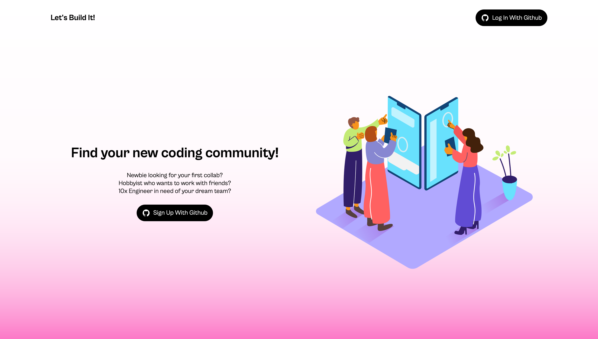

# Let's Build It



This project is meant to a place where developers of all skill levels can more easily find others to work with. Community is such an important part of developing passion in any field, and the tech industry much like many others can be relatively inaccessible to many groups of people. When I thought about my own fears in reaching out and working with others, I realized that others could be feeling the same way too. I thought, "what if there were a way to more easily find people like me to work on a project with?" and then thought "Huh, maybe I can build it." So, let's build it!

***This app is still under development!***
We're planning on:
- [ ] Implementing a robust search function for sorting through projects
- [ ] Enabling users to like posts
- [ ] Enabling users to comment on posts

We're currently discussing whether a chat function would fit in the MVP. It would be a great opportunity to learn about WebRTC.

## Getting Started

These instructions will get you a copy of the project up and running on your local machine for development and testing purposes. 

### Installing

1. Clone or fork this repository to make sure you have the files locally.
```console
git clone https://github.com/nicholasboyce/letsbuildit.git
```

Note: This project manages dependencies using pnpm. Install pnpm if you don't already have it.
```console
npm i -g pnpm
```

#### Prepare Your Environment

You'll need to set up PostgreSQL in order to get the proper functionality of this app. I recommend using [Docker](https://www.docker.com/blog/how-to-use-the-postgres-docker-official-image/).

You will also need to [create a GitHub OAuth App](https://docs.github.com/en/apps/oauth-apps/building-oauth-apps/creating-an-oauth-app) in order to enable the authentication features.

You'll also need to set up your environment variables. Please see the example.env file in the server folder. Once you've entered all the necessary values, change it to .env so that it can be read by the app. For development purposes, the APP_HOST variable will most likely be 'localhost.' 

The SESSION_SECRET is just like a password - it's recommended to generate something random and store it somewhere safe. For development purposes, it's okay for it to be a something you decide yourself.

1. Change directory into the 'client' folder. 
```console
cd client
```
and install the dependencies.
```console
pnpm install
```

2. Build the frontend to compile the TypeScript into JavaScript to be served on the backend.
```console
pnpm run build
```

3. From there, switch your working directory to the server folder.
```console
cd ../server
```
and install the dependencies.
```console
pnpm install
```

4a. For a production setup, run the build function to compile the TypeScript into JavaScript.
```console
pnpm run build
```
and serve the resulting files in /dist.
```console
pnpm run start
```

4b. If opting for a development setup, feel free to instead skip building and run the dev function directly.
```console
pnpm run dev
``` 

You should see the app report via the console that it's listening on the PORT you set up in your .env file!

## Running the tests

We're still developing a paradigm for robust testing on the frontend, and it will likely be mostly automated end to end testing.
For the backend, the goal has been to follow test-driven development as much as possible. This project uses the native Node testing suite to minimize external dependencies. It's very similar to Jest, if you have any experience with that.

The test function in the package.json functions but is VERY FLAKEY. PostgresDB has issues with (near) simultaneous calls to the database that do the same thing, meaning that the API test in particular tends to fail if run too soon. Currently, we're working on refactoring the tests in order to run all test suites that need access to the database sequentially, on the same connection. In the meantime, in order to ensure test reliability please test the files individually.

```console
NODE_ENV=test node --import tsx --test tests/<target-test-name>.test.ts
```

Style rules and automatted formatting guidelines are forthcoming.

## Built With

### Frontend:
* [React](https://react.dev/) - The web framework used
* [React Router](https://reactrouter.com/en/main) - Library for managing page rendering
* [CSS Modules](https://github.com/css-modules/css-modules) - Used to selectively style components
* [TypeScript](https://www.typescriptlang.org/) - A strongly typed programming language that builds on JavaScript
* [Vite](https://vitejs.dev/) - The build tool for development and production

### Backend
* [Node.js](https://nodejs.org/en) - The Javascript runtime
* [Express](https://expressjs.com/) - The backend framework used
* [PostgresQL](https://www.mongodb.com/) - SQL Database
* [PassportJS](https://www.passportjs.org/) - Authentication framework
* [csrf-sync](https://github.com/Psifi-Solutions/csrf-sync) - Used to implement synchronized CSRF protection
* [TypeScript](https://www.typescriptlang.org/) - A strongly typed programming language that builds on JavaScript
* [Kysely](https://kysely.dev/) - A type-safe SQL query builder for JavaScript

## Contributing

At the moment, please keep questions or discussions to the official [discussions page](https://github.com/nicholasboyce/letsbuildit/discussions).

## Authors

* **Nicholas Boyce** - [nicholasboyce](https://github.com/nicholasboyce)
* **Julian Ordaz** - [jordaz14](https://github.com/jordaz14)
